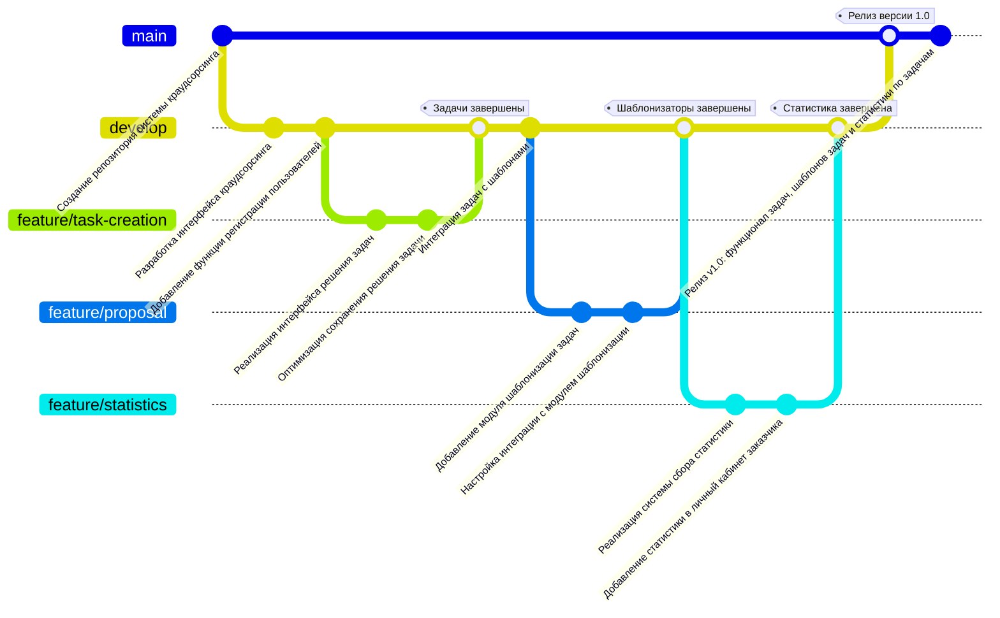
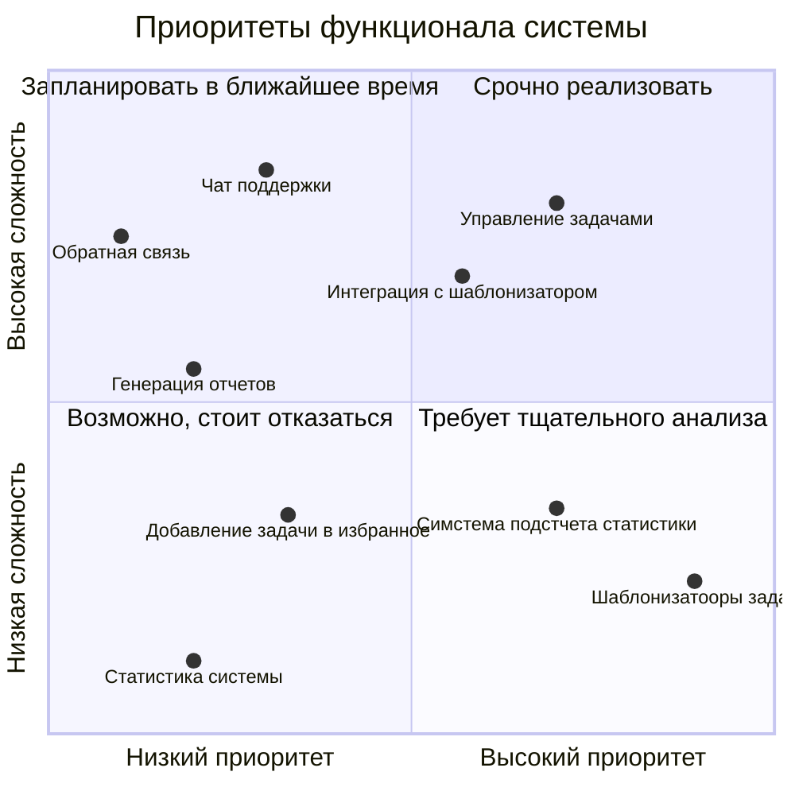
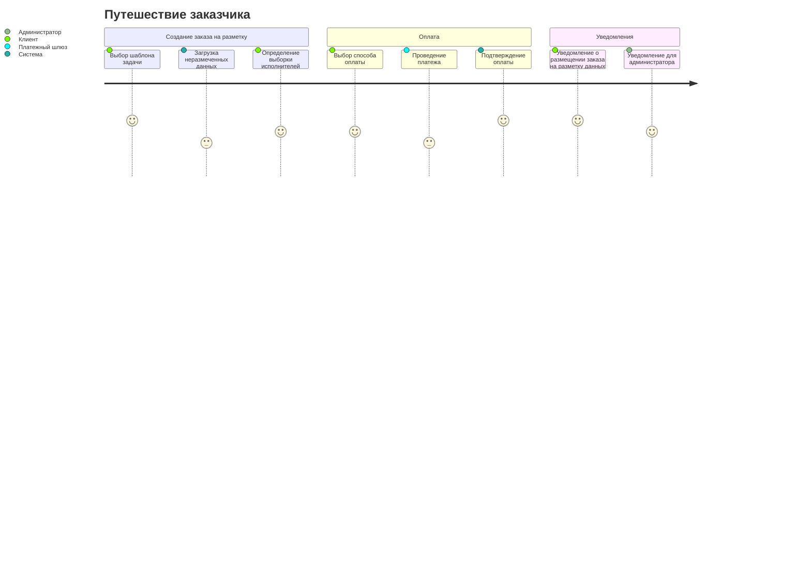
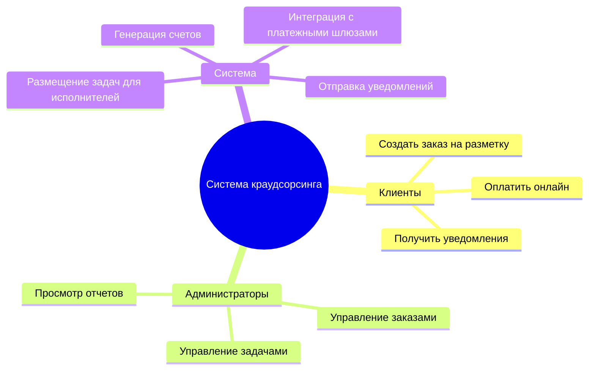

# Работа с Memaid в Github
## GitGraph

### Пояснения 
Первым на рассмотрении будет GitGraph. С его помощью можно отобразить базовый процесс работы с разными ветками при разработке системы. Такой граф является более наглядным в сравнение с ручным разбором истории коммитов.
Пример графа для системы краудсорсинга представлен выше
## Квадрант-граф

### Пояснения 
Следующим на рассмотрении идет Квадрант-граф. Он позволяет классифицировать задачи по разным критериям, например, высокая/низкая сложность и высокий/низкий приоритет. Данный подход удобен, когда в момент разработки возникает несколько задач и команда не сразу понимает за что браться. Данный граф помогает оценить каждую задачу и сфокусировать внимание на самых важных. Пример такого графа представлен выше.
## User Journey Diagram

### Пояснения
Третьим по очереди, но не по значению можно выделить User Journey Diagram. Данная диаграмма позволяет оценить пользовательский опыт при взаимодействии с каждым элементом нашей системы и выявить слабые места. 
## Mind Map

### Пояснения
И наконец последняя диаграмма – Mind Map. Данные диаграммы можно использовать для визуализации ключевых аспектов клиент-серверной системы, которые можно сгруппировать по ролям. 
